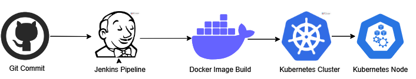

# Automating Docker and Kubernetes Deployment with Jenkins



# Prerequisites
<h3> Before we dive into the tutorial, you will need the following: </h3>
<h5> • A DockerHub account </h5>
<h5> • A Kubernetes cluster </h5>
<h5> • kubectl installed on your machine </h5>

<h3> 1. Set up the Jenkins server </h3>
Install Jenkins on the Jenkins server by following the installation instructions here. <br>
Install Docker on the Jenkins server by running the following commands

```sh
sudo apt update
sudo apt install docker.io -y
```

To add the Jenkins user to the Docker group and grant the required permissions, run the following commands:
```sh
sudo usermod -aG docker jenkins
sudo chmod 666 /var/run/docker.sock
```

Finally, to ensure that the changes take effect, restart the Jenkins service using the following command:
```sh
sudo systemctl restart jenkins
```

<h3> Server2: K-master </h3>
This server acts as the master node for the Kubernetes cluster and is connected to Jenkins as a slave using the label "k_master". 


<h3> Server3: K-Slave </h3>
This server acts as a worker node in the Kubernetes cluster and is connected to the K-master server.<br>
It is responsible for running containerized applications and supporting the deployment and scaling of those applications. <br> <br> 

Step 1: Create a Dockerfile

A Dockerfile is a script that contains a series of instructions for building a Docker image. This tutorial will use a simple Node.js application as an example.

```sh
FROM ubuntu/apache2
RUN apt-get update && rm -rf /var/www/html/*
COPY ./web-app /var/www/html/
EXPOSE 80
CMD apache2ctl -D FOREGROUND
```

This Dockerfile instructs Docker to use the official Node.js 12 image as the base image, set the working directory to "/app", copy the package.json file to the working directory, install dependencies, copy the application code to the container, expose port 3000, and run the command "npm start" when the container starts. 

Step 2: Build the Docker image

```sh
docker build -t your-dockerhub-username/node-app:latest .
```
This command will build the Docker image and tag it with "your-dockerhub-username/node-app:latest"

Step 3: Push the Docker image to DockerHub

Now that the Docker image has been built, we can push it to DockerHub so that it can be easily pulled down and deployed to a Kubernetes cluster.

```sh
docker login
```
Next, push the Docker image to DockerHub by running the following command:

```sh
docker push your-dockerhub-username/node-app:latest
```
This command will upload the Docker image to DockerHub, where it can be accessed by anyone with the appropriate credentials.

Step 4: Deploy the Docker image to a Kubernetes cluster

Now that the Docker image has been built and pushed to DockerHub, we can deploy it to a Kubernetes cluster.

Create a new file named "deployment.yaml" and add the following contents:

```sh
apiVersion: apps/v1
kind: Deployment
metadata:
  name: node-app
  labels:
    app: node-app
spec:
  replicas: 3
  selector:
    matchLabels:
      app: node-app
  template:
    metadata:
      labels:
        app: node-app
    spec:
      containers:
      - name: node-app
        image: your-dockerhub-username/node-app:latest
        ports:
        - containerPort: 3000
```

This file defines a Kubernetes Deployment resource that will create 3 replicas of our application.

Next, create a new file named "service.yaml" and add the following contents:

```sh
apiVersion: v1
kind: Service
metadata:
  name: node-app
spec:
  selector:
    app: node-app
  type: NodePort
  ports:
  - port: 80
    targetPort: 80
    nodePort: 3000
```

Create a Jenkins pipeline to automate this process

```sh
pipeline {
    agent any

    stages {
        stage('Clone Repo') {
            steps {
                sh 'rm -rf <repo-directory-name>'
                sh 'git clone <repo>'
            }
        }
         
        stage('Install_Docker') {
            steps {
                script {
                    def dockerPath = sh(script: 'which docker', returnStatus: true)
                    if (dockerPath != 0) {
                        sh 'apt update'
                        sh 'apt-get install docker.io -y -q'
                    } else {
                        echo 'Docker is already installed'
                  }
               }
            }
         }        

        stage('Build Image') {
            steps {
                sh 'docker build -t your-dockerhub-username/node-app:latest .'
            }
        }

        stage('Run Container') {
            steps {
                sh '''
                    #!/bin/bash
                    docker stop my_project-1 || true
                    docker rm my_project-1 || true
                    docker run -d -p 8081:80 --name my_project-1 your-dockerhub-username/node-app:latest
                '''
            }
        }

        stage('Push Image') {
            steps {
                withCredentials([string(credentialsId: 'dockerhub-cred', variable: 'dockerhub-cred')]) {
                    sh '''
                        #!/bin/bash
                        docker login -u <Dockerhub_username> -p ${dockerhub-cred}
                        docker push your-dockerhub-username/node-app:latest
                    '''
                }
            }
        }

        stage('Deploy to K8s Server') {
            agent {
                label 'k_master'
            }
            steps {
                script {
                    try {
                        sh 'kubectl apply -f deployment.yaml --record=true'
                        sh 'kubectl apply -f services.yaml'
                    } catch (error) {
                        sh 'kubectl create -f deployment.yaml'
                        sh 'kubectl create -f services.yaml'
                    }
                }
            }
        }
    }
}
```

`Clone Repo` : This stage clones the source code from a GitHub repository. 

`Install_Docker` : This stage checks if Docker is installed and installs it if it is not already installed. If Docker is already installed, the stage skips the installation.

`Build Image` : This stage builds a Docker image using the source code and Dockerfile in the cloned repository.

`Run Container` : This stage runs a Docker container from the image built in the previous stage.

`Push Image` : This stage logs into Docker Hub using a set of credentials, and pushes the newly built Docker image to the Docker Hub registry.

`Deploy to K8s Server` : This stage deploys the newly built Docker image to a Kubernetes cluster. This stage is executed on a Kubernetes agent, which is specified using the label attribute in the agent block.

Overall, the pipeline automates the entire process of building and deploying a Docker image to a Kubernetes cluster, enabling continuous integration and deployment of applications. 
